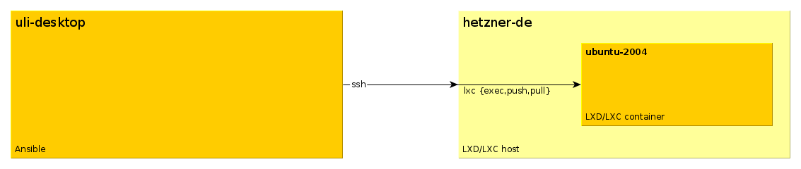

# ansible-lxdlxc-container-prototype

A prototype managing lxdlxc containers using ansible.
The basic idea is to ssh into the lxd host and
communicate with the container via the lxd command line
tools.



I do have

- my desktop computer named "uli-desktop". I'm running ansible here
- a lxd/lxc host named "hetzner-de"
- a ssh connection to "hetzner-de" - executing `ssh hetzner-de` gives me a root shell on the machine
- a lxd/lxc container named "ubuntu-2004" running on "hetzner-de"

I do want to modify the lxd/lxc container using ansible.

## Existing Solutions

### Standard ansible connection "lxd"

There is a standard ansible connection plugin named "lxd".
It works quite nicely, but

- requires the lxc command line tools to be installed on my desktop computer "uli-desktop"
- requires a remote lxc connection from my desktop computer "uli-desktop" to the lxd/lxc host "hetzner-de"

I don't like these requirements!

### lxc_ssh

On Github, there is a connection plugin named [chiffier/lxc_ssh](https://github.com/chifflier/ansible-lxc-ssh)

There are these issues:

- very old implementation - about 5 years old
- uses `lxc attach` which isn't supported in recent versions of lxc

I didn't do any experiments with this plugin

### sshlxc

On Github, there is a connection plugin named [antifuchs/sshlxc](https://github.com/antifuchs/ansible-sshlxd-connection)

There are these issues:

- very old implementation - about 5 years old
- does not work for me on ansible 2.9
- its documentation is inconsistent, especially the terms "lxc" and "lxd" are mixed up in various places

### sshjail

"sshlxc" is based on [sshjail](https://github.com/austinhyde/ansible-sshjail).
There seems to be active maintenance on sshjail, so I decided
to base my lxc solution on this. I incorporated this
[sshjail - fork](https://github.com/seliopou/ansible-sshjail), too.

## Install

To use this plugin, you'll have to:

- create a folder "connection_plugins" in your ansible project
- copy the file "sshlxd.py" into this folder

## Usage

To use the plugin, you'll have to configure your lxc container correctly.
You can use [host_vars/ubuntu-2004.yml](host_vars/ubuntu-2004.yml) as a starting point.

Important are these:

- ansible_connection: Use "sshlxd" for this!
- ansible_host: Use a combination of "{{lxdhost}}:{{containername}}" for this!

## Modifications to sshjail

### Variablen und Bezeichnungen

1. Name of the transport: `sshjail` -> `sshlxculi`
2. jailname -> containername
3. jailhost -> lxchost
4. jailspec -> containerspec
5. self.jid -> N/A
6. self.jname -> self.containername
7. self.connector -> N/A

### Methods

1. match_jail -> match_container
2. _jailhost_command ->_lxchost_command
3. get_jail_id -> get_lxc_name
4. get_jail_connector -> N/A
!! 5. get_jail_path -> N/A

### Commands

1. `jls -q jid name host.hostname path` -> `lxc list --columns n --format csv`

## Problems

### Separate pythons for lxchost and container

Currently, it seems that both the lxchost and the container have to use the same python, i.e. `/usr/bin/python3`.

### Platform unknown on host ubuntu-2004 is using the discovered Python interpreter at /usr/bin/python

Fixed by:

```diff
diff --git a/host_vars/ubuntu-2004.yml b/host_vars/ubuntu-2004.yml
index 88c385b..9f4417b 100644
--- a/host_vars/ubuntu-2004.yml
+++ b/host_vars/ubuntu-2004.yml
@@ -1,2 +1,3 @@
 ansible_connection: sshlxculi
 ansible_host: ubuntu-2004@hetzner-de
+ansible_python_interpreter: /usr/bin/python3
```

## Links

* [sshlxc](https://github.com/antifuchs/ansible-sshlxd-connection)
* [sshjail](https://github.com/austinhyde/ansible-sshjail)
* [sshjail - fork](https://github.com/seliopou/ansible-sshjail)
* [lxc_ssh](https://github.com/chifflier/ansible-lxc-ssh)
